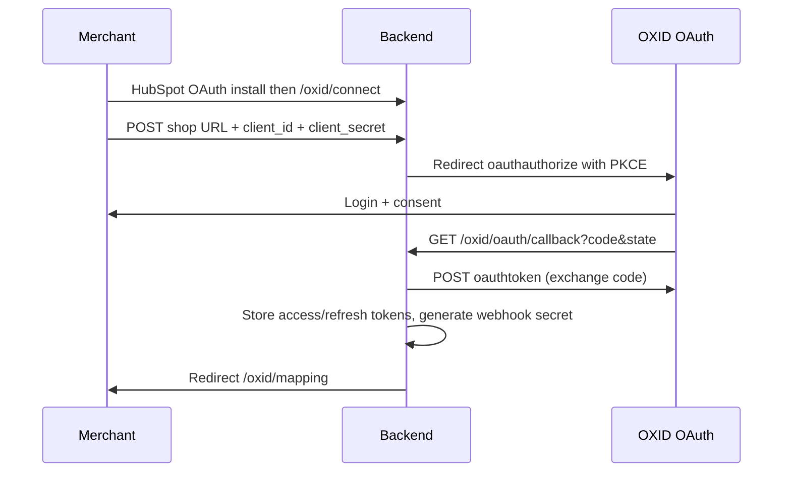

# OXID module contract

This document specifies what the OXID shop-side setup must provide for this backend. The backend
handles HubSpot OAuth and OXID OAuth; the shop module's job is **push webhooks** for customer
changes.

Throughout, `BACKEND_URL` is the public base URL of this service (e.g.
`https://hubspot-sync.example.com`).

See also [API_DOCUMENTATION.md](../../API_DOCUMENTATION.md) for the MWV API OAuth 2.0 endpoints
(`oauthauthorize`, `oauthtoken`, `oauthme`).

---

## 1. OXID OAuth (merchant setup — no custom PHP pairing module)

The merchant connects their shop via **OAuth 2.0 Authorization Code + PKCE** (MWV API v1.5+).

### 1.1 Shop prerequisites

In OXID Admin → Extensions → Modules → API → OAuth 2.0:

1. Enable OAuth (`mwvapi_blMOAuthAPI`).
2. Create an OAuth client (MWV API → OAuth 2.0 Clients):
   - **Redirect URI:** `{BACKEND_URL}/oxid/oauth/callback` (exact match)
   - **Scopes:** `profile address api`
   - **PKCE:** required (`S256`)
3. Copy `client_id` and `client_secret`.

### 1.2 Connect flow



The backend stores encrypted OXID access + refresh tokens and refreshes them automatically. No
`api_key` or `/oxid/pair/callback` is used.

### 1.3 Webhook credentials

After OAuth succeeds, the merchant copies from **HubSpot → Connected apps → OXID HubSpot Sync →
Settings**:

- `webhook_url` — `{BACKEND_URL}/webhooks/oxid/{oxid_shop_id}`
- `webhook_secret` — HMAC signing secret for push events

Configure these in the shop module that sends customer webhooks (section 2).

---

## 2. Push: customer changes

### 2.1 When to fire

Hook the customer save/insert/delete events (`oxcustomer::save`, `::insert`, `::update`, `::delete`,
or the equivalent event subscriber for your OXID version) and fire for:

| Event              | `event` value       |
| ------------------ | ------------------- |
| Customer created   | `customer.created`  |
| Customer updated   | `customer.updated`  |
| Customer deleted   | `customer.deleted`  |

Only fire when at least one **mapped** field changed: `email`, `firstName`, `lastName`, `phone`,
`company`, `address`, `city`, `zip`, `country`.
Sending on every save is harmless (the backend detects and skips no-op writes) but wasteful.

Do the HTTP call **out of the request path** if your setup allows it (queue, cron, `fastcgi_finish_request`)
so a slow network never blocks the merchant's admin. The backend answers in a few milliseconds
because it only verifies and enqueues, but the shop should not depend on that.

### 2.2 Request

```http
POST {webhook_url}
Content-Type: application/json
X-MWV-Timestamp: 1725704400
X-MWV-Signature: sha256=<base64>

{
  "event": "customer.updated",
  "occurredAt": "2026-08-04T09:12:33.000Z",
  "shopId": "3f9c1d1e-....",
  "customer": {
    "id": "oxid-customer-oxid-value",
    "email": "kunde@example.com",
    "firstName": "Anna",
    "lastName": "Beispiel",
    "phone": "+49 30 123456",
    "updatedAt": "2026-08-04T09:12:31.000Z"
  }
}
```

Rules:

- `customer.email` is **required** — it is the unique key for matching and dedupe on both sides.
  Without it the event is logged as `skipped_no_email`.
- `customer.id` (OXID internal id) is optional metadata; the backend keys records by normalized
  email, not by `id` or `mcustnr`.
- Omit or `null` any field the shop does not have. `null` means "no value", it does not mean
  "unchanged".
- `occurredAt` and `customer.updatedAt` are ISO-8601 UTC.
- `shopId` is the `oxid_shop_id` shown in HubSpot Settings after OAuth. It must match the id in the URL.
- `event` may be omitted; it defaults to `customer.updated`.

#### 2.2.1 Alternative: raw OXID `users` object (no normalization in the module)

If the shop module already has the native OXID user row, it may POST it as-is. The backend maps
field names automatically via `fromOxidUserWebhook()`. **`oxusername` (email) is required** and is
the record key; `mcustnr` and `oxid` are optional metadata and are not used for dedupe:

```json
{
  "users": {
    "oxusername": "j.smith02@merzljak.de",
    "oxfname": "Jane02",
    "oxlname": "Smith02",
    "oxcreate": "2026-07-31T17:28:36+02:00",
    "child_ids": [{ "oxfon": "+49 30 12345678" }]
  }
}
```

### 2.3 Signature

The signed string is the timestamp, a literal dot, then the **exact raw JSON bytes** that are sent
(MWV shop module contract):

```
signedPayload = X-MWV-Timestamp + "." + rawBody
signature     = "sha256=" + base64(hmac_sha256(signedPayload, webhook_secret))
```

`X-MWV-Timestamp` is Unix time in **seconds** (PHP `time()`). The backend rejects anything more than 5
minutes off its own clock, so the shop's clock must be roughly correct (NTP). The receiver strips the
`sha256=` prefix before comparing digests.

### 2.4 Responses and retries

| Status | Meaning                                       | Module should                                  |
| ------ | --------------------------------------------- | ---------------------------------------------- |
| `202`  | Accepted and queued                            | Consider it delivered                          |
| `400`  | Malformed payload                              | Log, do not retry — it will never succeed      |
| `401`  | Bad or missing signature / stale timestamp     | Log loudly, check secret and clock, do not retry |
| `404`  | Unknown `oxidShopId`                           | Shop is no longer connected — stop sending, re-authorize |
| `409`  | Integration paused                             | Retry later                                    |
| `5xx`  | Backend problem                                | Retry with backoff (e.g. 1m, 5m, 30m)          |

---

## 3. What the backend needs to call *into* OXID

For the HubSpot → OXID direction, the backend uses **OAuth 2.0 bearer tokens** (refresh-token
grant) against the MWV User API. See [API_DOCUMENTATION.md](../../API_DOCUMENTATION.md).

The real adapter is [../src/oxid/adapters/oxapiClient.ts](../src/oxid/adapters/oxapiClient.ts)
(`OXID_CLIENT_MODE=oxapi`).

### 3.1 HubSpot → OXID (email-first upsert)

When HubSpot fires `object.creation` or a mapped `object.propertyChange`, the backend:

1. Fetches the full contact from HubSpot CRM by `objectId` (webhooks do not include email).
2. Normalizes email as the natural key (`oxusername`).
3. Calls `POST ?cl=userapi&fnc=updateUsers` with mapped fields (`oxfname`, `oxlname`, `oxfon`, …).
   Prefers `oxid` when `entity_mappings.oxid_record_id` is known; otherwise identifies by
   `oxusername` (email).
4. If the shop returns "user not found", calls `POST ?cl=userapi&fnc=insertUsers` with the same
   fields (always keyed by `oxusername`). When `OXID_USER_INSERT_PASSWORD` is configured, an encrypted `password` is included;
   otherwise the field is omitted.

After a successful write, the backend stores the normalized **email** in `entity_mappings` as the
OXID-side key for future sync and loop detection.

---

## 4. Testing the contract without the module

Signed webhook (credentials from HubSpot Settings after OAuth):

```bash
SECRET='<webhook_secret from Settings>'
SHOP_ID='<oxid_shop_id from Settings>'
BODY='{"event":"customer.updated","shopId":"'$SHOP_ID'","customer":{"id":"c-1","email":"kunde@example.com","firstName":"Anna","lastName":"Beispiel","phone":"+49301234"}}'
TS=$(date +%s)
SIG=$(printf '%s.%s' "$TS" "$BODY" | openssl dgst -sha256 -hmac "$SECRET" -binary | base64)

curl -sS -X POST "$BACKEND_URL/webhooks/oxid/$SHOP_ID" \
  -H 'Content-Type: application/json' \
  -H "X-MWV-Timestamp: $TS" \
  -H "X-MWV-Signature: sha256=$SIG" \
  --data-raw "$BODY"
```

Tamper with one byte of `BODY` after computing `SIG` and the same call must return `401`.
