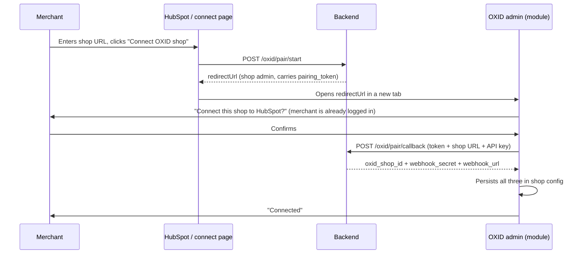

# OXID module contract

This document specifies what the PHP module installed in each OXID shop must do to work with this
backend. The backend is already built against this contract; implementing it exactly means no
backend changes are needed.

Two responsibilities:

1. **Pairing** — an admin page that links this shop to the merchant's HubSpot portal.
2. **Push** — send customer changes to the backend, HMAC-signed.

Throughout, `BACKEND_URL` is the public base URL of this service (e.g.
`https://hubspot-sync.example.com`).

---

## 1. Pairing

### 1.1 What the merchant sees



### 1.2 The admin page

Register an admin controller reachable as:

```
{shop_base_url}/admin/index.php?cl=hubspot_connect&pairing_token=<token>
```

The backend builds exactly this URL, so the class name must be `hubspot_connect` and the query
parameter must be named `pairing_token`.

Requirements:

- **The existing OXID admin session is the authentication.** If the request is not an authenticated
  admin session, OXID's own admin bootstrap redirects to the login screen — that is the intended
  behaviour and the whole login story. Do not build a separate login.
- Render a confirmation step ("Connect this shop to HubSpot?") with a confirm button. Never pair on
  a bare `GET`; the confirm action must be a `POST` with OXID's CSRF token (`stoken`).
- Treat `pairing_token` as opaque. Do not log it.

### 1.3 Generating the shop API key

On confirm, the module needs a long-lived credential the backend can later use to authenticate
against this shop:

- If the shop already has one stored (from an earlier pairing), reuse it.
- Otherwise generate at least 32 bytes of cryptographically secure randomness
  (`random_bytes(32)`, hex or base64 encoded) and store it in the shop config.
- The backend stores this value encrypted (AES-256-GCM) and never logs it.

### 1.4 Calling back

```http
POST {BACKEND_URL}/oxid/pair/callback
Content-Type: application/json

{
  "pairing_token": "<value from the URL>",
  "shop_url": "https://shop.example.com",
  "api_key": "<the shop API key>"
}
```

`shop_url` must be the shop's **base** URL — no `/admin`, no trailing slash, no query string. Its
host must match the host the merchant entered in HubSpot, otherwise the backend rejects the pairing
with `400`.

Success response (`200`):

```json
{
  "status": "ok",
  "oxid_shop_id": "3f9c1d1e-....",
  "webhook_secret": "9a1f...64 hex chars",
  "webhook_url": "https://hubspot-sync.example.com/webhooks/oxid/3f9c1d1e-....",
  "hubspot_portal_id": "24681012"
}
```

**Persist all four values in the shop config.** `webhook_secret` is returned exactly once — there is
no endpoint to read it back, and losing it means the merchant has to re-pair.

Failure responses:

| Status | Meaning                                                        | What the module should show                  |
| ------ | -------------------------------------------------------------- | -------------------------------------------- |
| `400`  | Token invalid, expired (10 min TTL), already used, or host mismatch | "This link has expired, start again in HubSpot" |
| `404`  | No HubSpot integration for that portal                          | "Install the HubSpot app first"              |
| `429`  | Rate limited                                                    | "Too many attempts, try again shortly"       |

The token is **single use**. A second callback with the same token always fails, including when two
requests race — the backend claims the token in one atomic statement.

---

## 2. Push: customer changes

### 2.1 When to fire

Hook the customer save/insert/delete events (`oxcustomer::save`, `::insert`, `::update`, `::delete`,
or the equivalent event subscriber for your OXID version) and fire for:

| Event              | `event` value       |
| ------------------ | ------------------- |
| Customer created   | `customer.created`  |
| Customer updated   | `customer.updated`  |
| Customer deleted   | `customer.deleted`  |

Only fire when at least one **mapped** field changed: `email`, `firstName`, `lastName`, `phone`,
`company`, `address`, `city`, `zip`, `country`.
Sending on every save is harmless (the backend detects and skips no-op writes) but wasteful.

Do the HTTP call **out of the request path** if your setup allows it (queue, cron, `fastcgi_finish_request`)
so a slow network never blocks the merchant's admin. The backend answers in a few milliseconds
because it only verifies and enqueues, but the shop should not depend on that.

### 2.2 Request

```http
POST {webhook_url}
Content-Type: application/json
X-Oxid-Timestamp: 1775298753123
X-Oxid-Signature: sha256=<hex>

{
  "event": "customer.updated",
  "occurredAt": "2026-08-04T09:12:33.000Z",
  "shopId": "3f9c1d1e-....",
  "customer": {
    "id": "oxid-customer-oxid-value",
    "email": "kunde@example.com",
    "firstName": "Anna",
    "lastName": "Beispiel",
    "phone": "+49 30 123456",
    "updatedAt": "2026-08-04T09:12:31.000Z"
  }
}
```

Rules:

- `customer.id` is required and must be the shop's stable customer id (`oxid` column of
  `oxuser`). It is what the backend stores as `oxid_customer_id`.
- `customer.email` is required for `created`/`updated`. Without it there is nothing to match on in
  HubSpot and the event is logged as `skipped_no_email`.
- Omit or `null` any field the shop does not have. `null` means "no value", it does not mean
  "unchanged".
- `occurredAt` and `customer.updatedAt` are ISO-8601 UTC.
- `shopId` is the `oxid_shop_id` from pairing. It must match the id in the URL.
- `event` may be omitted; it defaults to `customer.updated`.

#### 2.2.1 Alternative: raw OXID `users` object (no normalization in the module)

If the shop module already has the native OXID user row, it may POST it as-is. The backend maps
field names automatically via `fromOxidUserWebhook()`:

```json
{
  "users": {
    "oxusername": "j.smith02@merzljak.de",
    "oxfname": "Jane02",
    "oxlname": "Smith02",
    "mcustnr": "66666692",
    "oxcreate": "2026-07-31T17:28:36+02:00",
    "child_ids": [{ "oxfon": "+49 30 12345678" }]
  }
}
```

Mapping applied server-side:

| OXID field | Canonical / HubSpot |
| ---------- | ------------------- |
| `oxusername` | `email` |
| `oxfname` | `firstName` / `firstname` |
| `oxlname` | `lastName` / `lastname` |
| `oxfon` on user, else first `child_ids[].oxfon` | `phone` |
| `oxcompany` on user, else first `child_ids[].oxcompany` | `company` |
| `oxstreet` + `oxstreetnr` on user, else first child with street data | `address` |
| `oxcity` on user, else first `child_ids[].oxcity` | `city` |
| `oxzip` on user, else first `child_ids[].oxzip` | `zip` |
| `oxcountryid` on user, else first `child_ids[].oxcountryid` | `country` |
| `oxid` if present, else `mcustnr` | record id (`oxid_customer_id`) |

Optional wrapper fields (`event`, `shopId`, `occurredAt`) work the same as in section 2.2. The normalized
`customer` format in section 2.2 also accepts `company`, `address`, `city`, `zip`, and `country`.

### 2.3 Signature

The signed string is the timestamp, a literal dot, then the **exact raw JSON bytes** that are sent:

```
signedPayload = X-Oxid-Timestamp + "." + rawBody
signature     = "sha256=" + bin2hex(hmac_sha256(signedPayload, webhook_secret))
```

```php
$rawBody   = json_encode($payload, JSON_UNESCAPED_UNICODE | JSON_UNESCAPED_SLASHES);
$timestamp = (string) round(microtime(true) * 1000);
$signature = 'sha256=' . hash_hmac('sha256', $timestamp . '.' . $rawBody, $webhookSecret);

// Send $rawBody verbatim. Re-encoding it changes the bytes and breaks the signature.
```

`X-Oxid-Timestamp` is Unix time in **milliseconds**. The backend rejects anything more than 5
minutes off its own clock, so the shop's clock must be roughly correct (NTP).

### 2.4 Responses and retries

| Status | Meaning                                       | Module should                                  |
| ------ | --------------------------------------------- | ---------------------------------------------- |
| `202`  | Accepted and queued                            | Consider it delivered                          |
| `400`  | Malformed payload                              | Log, do not retry — it will never succeed      |
| `401`  | Bad or missing signature / stale timestamp     | Log loudly, check secret and clock, do not retry |
| `404`  | Unknown `oxidShopId`                           | Shop is no longer paired — stop sending, prompt re-pair |
| `409`  | Integration paused                             | Retry later                                    |
| `5xx`  | Backend problem                                | Retry with backoff (e.g. 1m, 5m, 30m)          |

A `202` means queued, not synced. Delivery is at-least-once by design: retries are safe because the
backend deduplicates and skips writes whose content already matches.

If delivery fails permanently, do nothing further — the backend's reconciliation job sweeps both
sides every 15 minutes and will pick the change up.

---

## 3. What the backend needs to call *into* OXID

For the HubSpot → OXID direction, the backend needs to read and write customers. This part is
**pending your OXID API details** — the backend currently runs against a stub adapter
(`OXID_CLIENT_MODE=stub`) and the real adapter lives in one file,
[../src/oxid/adapters/oxapiClient.ts](../src/oxid/adapters/oxapiClient.ts).

Please confirm:

1. **Authentication.** The assumed flow is `POST {shop}/oxapi/token` with
   `{ "apiKey": "...", "grantType": "client_credentials" }` returning `{ access_token, expires_in }`.
   If that is wrong, the actual endpoint, request shape, and token lifetime.
2. **Read a customer** by id and by email.
3. **Create a customer** with email, first name, last name, phone.
4. **Update an arbitrary existing customer** — note that OXID's standard `graphql-storefront`
   only exposes self-service mutations scoped to the *logged-in* customer, so an admin-capable
   operation (or a small REST endpoint added to this module) is usually required.
5. **List customers modified since a timestamp**, for the reconciliation job.

If a suitable API does not exist, the simplest path is to expose these five operations as REST
endpoints on this module, authenticated with the same `api_key` from pairing.

---

## 4. Testing the contract without the module

Both directions can be verified with `curl` before any PHP exists.

Pairing callback (expects `400` for a bogus token, which proves validation works):

```bash
curl -sS -X POST "$BACKEND_URL/oxid/pair/callback" \
  -H 'Content-Type: application/json' \
  -d '{"pairing_token":"nope","shop_url":"https://shop.example.com","api_key":"0123456789abcdef"}'
```

Signed webhook:

```bash
SECRET='<webhook_secret from pairing>'
SHOP_ID='<oxid_shop_id from pairing>'
BODY='{"event":"customer.updated","shopId":"'$SHOP_ID'","customer":{"id":"c-1","email":"kunde@example.com","firstName":"Anna","lastName":"Beispiel","phone":"+49301234"}}'
TS=$(($(date +%s) * 1000))
SIG=$(printf '%s.%s' "$TS" "$BODY" | openssl dgst -sha256 -hmac "$SECRET" -hex | sed 's/^.* //')

curl -sS -X POST "$BACKEND_URL/webhooks/oxid/$SHOP_ID" \
  -H 'Content-Type: application/json' \
  -H "X-Oxid-Timestamp: $TS" \
  -H "X-Oxid-Signature: sha256=$SIG" \
  --data-raw "$BODY"
```

Tamper with one byte of `BODY` after computing `SIG` and the same call must return `401`.
